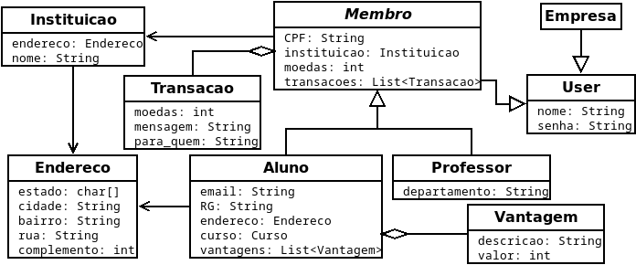
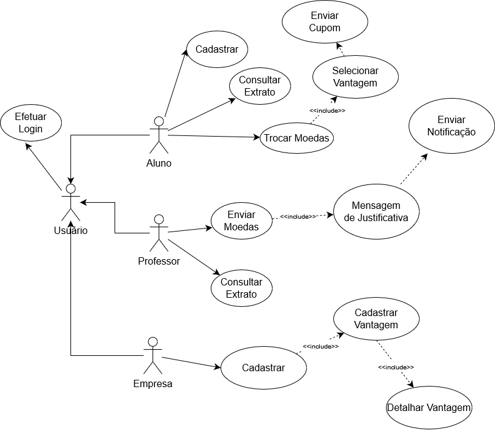
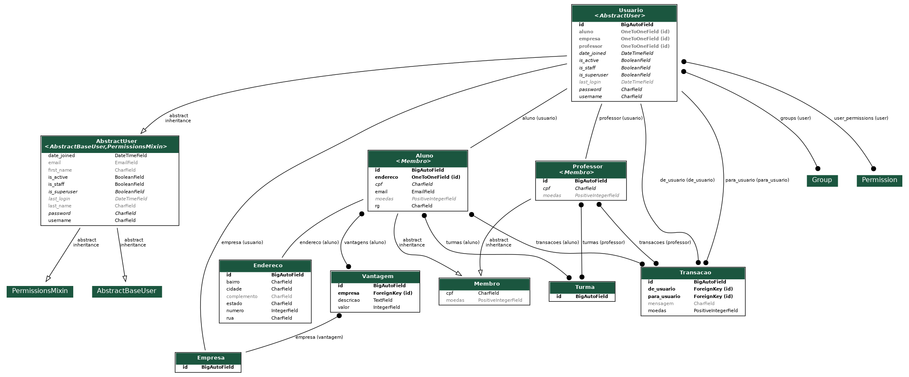

# Documentação do projeto

## Diagrama de Classes

## Casos de uso

## Modelo ER

## Definições

Para definições de bd e casos de uso, veja [casos](./casos_de_uso/README.md) e [bd](./db/README.md).